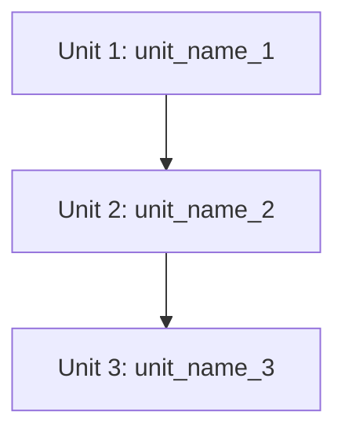

# AI-DLC Inception: Unit Breakdown

これより、タスク分解フェーズを開始します。
対象の `docs/aidlc/[feature_name]/inception/story.md` を読み込んでください。

以下の手順を実行してください。

1. **Unit Definition**:
   - ストーリーを実装可能な「Unit」に分解する。
   - 各Unitには、後でフォルダ名として使える簡潔な名前（例: `create_table`）を付けること。

2. **Output**:
   - `docs/aidlc/[feature_name]/inception/units.md` にUnit一覧を保存する。
   - 依存関係と実装順序も記述する。

**アクション:**
どの機能フォルダ（[feature_name]）の続きを行うか確認し、Unit分解案を提示してください。

---

## テンプレート: units.md

````markdown
# Units: [機能名]

## Unit一覧

### Unit 1: [unit_name_1]

**説明**: [このUnitで実装する内容の概要]

**スコープ:**

- [実装項目1]
- [実装項目2]

**依存関係:**

- なし

---

### Unit 2: [unit_name_2]

**説明**: [このUnitで実装する内容の概要]

**スコープ:**

- [実装項目1]
- [実装項目2]

**依存関係:**

- Unit 1: [unit_name_1]

---

## 実装順序



## 更新履歴

| 日付       | 内容     |
| ---------- | -------- |
| YYYY-MM-DD | 初版作成 |
````
