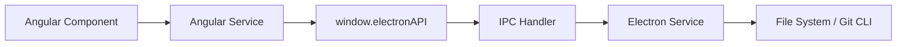

# AI-DLC 成果物テンプレート

本プロジェクト（SquadApp）向けにカスタマイズされた AI-DLC 成果物テンプレート集。

---

## Inception フェーズ

### requirements.md

<!-- 保存先: docs/aidlc/{feature_name}/inception/requirements/requirements.md -->

```markdown
# Requirements: [機能名]

## リクエスト分析

- **種別**: [New Feature / Bug Fix / Refactoring / Enhancement]
- **スコープ**: [Single File / Single Component / Multiple Components / System-wide]
- **複雑さ**: [Trivial / Simple / Moderate / Complex]

## 機能要件

### FR1: [要件タイトル]

[要件の説明]

### FR2: [要件タイトル]

[要件の説明]

## 非機能要件

### パフォーマンス

- [要件]

### セキュリティ

- [要件]

### アクセシビリティ

- [要件]

## 制約事項

- [制約]

## 更新履歴

| 日付       | 内容     |
| ---------- | -------- |
| YYYY-MM-DD | 初版作成 |
```

### stories.md

<!-- 保存先: docs/aidlc/{feature_name}/inception/user-stories/stories.md -->

```markdown
# User Stories: [機能名]

## ペルソナ

### [ペルソナ名]

- **役割**: [役割]
- **目標**: [達成したいこと]
- **コンテキスト**: [利用状況]

## ストーリー

### US1: [ストーリータイトル]

**As a** [ペルソナ]
**I want to** [実現したいこと]
**So that** [得られる価値]

#### 受入条件

**AC1: [条件タイトル]**

- **Given** [前提条件]
- **When** [アクション]
- **Then** [期待結果]

**AC2: [条件タイトル]**

- **Given** [前提条件]
- **When** [アクション]
- **Then** [期待結果]

## 更新履歴

| 日付       | 内容     |
| ---------- | -------- |
| YYYY-MM-DD | 初版作成 |
```

### components.md

<!-- 保存先: docs/aidlc/{feature_name}/inception/application-design/components.md -->

```markdown
# Application Design: Components — [機能名]

## コンポーネント一覧

### [ComponentName]

- **種別**: Angular Component / Angular Service / Electron Service
- **責務**: [このコンポーネントの責務]
- **配置**: [ファイルパス]
- **インターフェース**:
  - Input: [入力]
  - Output: [出力]

## 更新履歴

| 日付       | 内容     |
| ---------- | -------- |
| YYYY-MM-DD | 初版作成 |
```

### component-dependency.md

<!-- 保存先: docs/aidlc/{feature_name}/inception/application-design/component-dependency.md -->

````markdown
# Application Design: Component Dependencies — [機能名]

## 依存関係マトリクス

| コンポーネント      | 依存先             | 通信方式                 |
| ------------------- | ------------------ | ------------------------ |
| [Angular Component] | [Angular Service]  | DI（依存性注入）         |
| [Angular Service]   | [Electron API]     | window.electronAPI (IPC) |
| [IPC Handler]       | [Electron Service] | 直接呼び出し             |

## データフロー


````

## 更新履歴

| 日付       | 内容     |
| ---------- | -------- |
| YYYY-MM-DD | 初版作成 |

````

### unit-of-work.md

<!-- 保存先: docs/aidlc/{feature_name}/inception/application-design/unit-of-work.md -->

```markdown
# Units of Work: [機能名]

## Unit 定義

### Unit: [unit_name]

- **種別**: Service / Module
- **説明**: [この Unit の概要]
- **責務**:
  - [責務1]
  - [責務2]
- **含まれるモジュール**（モノリスの場合）:
  - [Module 1]: [説明]
  - [Module 2]: [説明]

## 更新履歴

| 日付 | 内容 |
|---|---|
| YYYY-MM-DD | 初版作成 |
````

### unit-of-work-dependency.md

<!-- 保存先: docs/aidlc/{feature_name}/inception/application-design/unit-of-work-dependency.md -->

```markdown
# Unit of Work Dependencies: [機能名]

## 依存関係マトリクス

| Unit          | 依存先 Unit   | 依存の種類       |
| ------------- | ------------- | ---------------- |
| [unit_name_1] | なし          | —                |
| [unit_name_2] | [unit_name_1] | データモデル参照 |

## 更新履歴

| 日付       | 内容     |
| ---------- | -------- |
| YYYY-MM-DD | 初版作成 |
```

### unit-of-work-story-map.md

<!-- 保存先: docs/aidlc/{feature_name}/inception/application-design/unit-of-work-story-map.md -->

```markdown
# Unit of Work — Story Mapping: [機能名]

## マッピング

| ストーリー      | Unit        | 受入条件 |
| --------------- | ----------- | -------- |
| US1: [タイトル] | [unit_name] | AC1, AC2 |
| US2: [タイトル] | [unit_name] | AC3, AC4 |

## カバレッジ確認

- [ ] 全ストーリーが Unit に割り当てられている
- [ ] 全受入条件が Unit に割り当てられている
- [ ] 未割り当てのストーリーがない

## 更新履歴

| 日付       | 内容     |
| ---------- | -------- |
| YYYY-MM-DD | 初版作成 |
```

---

## Construction フェーズ

### functional-design.md（本プロジェクト向け）

<!-- 保存先: docs/aidlc/{feature_name}/construction/{unit_name}/design.md -->

````markdown
# Functional Design: [unit_name]

## 概要

[この Unit で実現する機能の概要]

## データモデル

### zod スキーマ

```typescript
// スキーマ定義
export const XxxSchema = z.object({
  id: z.string(),
  name: z.string().min(1).max(255),
});

export type Xxx = z.infer<typeof XxxSchema>;
```
````

### バリデーションルール

- [ルール1]
- [ルール2]

## IPC チャネル仕様

### [channel:name]

- **方向**: Renderer → Main
- **リクエスト型**: `XxxRequest`
- **レスポンス型**: `IpcResult<XxxResponse>`
- **エラーコード**:
  - `VALIDATION_ERROR`: [条件]
  - `NOT_FOUND`: [条件]

## ビジネスルール

### [ルール名]

- **条件**: [いつ適用されるか]
- **動作**: [何が起こるか]
- **エラー時**: [エラーハンドリング]

## コンポーネント構成

```
src/app/[feature]/
├── [feature].ts              # コンポーネント
├── [feature].html            # テンプレート
├── [feature].css             # スタイル
├── [feature].spec.ts         # テスト
└── [feature].service.ts      # サービス

electron/[domain]/
├── [service].ts              # サービス
└── [service].spec.ts         # テスト
```

## テスト計画

### ユニットテスト

- [ ] [テストケース1]
- [ ] [テストケース2]

### 統合テスト

- [ ] [テストケース1]

## 更新履歴

| 日付       | 内容     |
| ---------- | -------- |
| YYYY-MM-DD | 初版作成 |

````

### code-generation-plan.md

<!-- 保存先: docs/aidlc/{feature_name}/construction/{unit_name}/plan.md -->

```markdown
# Code Generation Plan: [unit_name]

## 概要
[この Unit で生成するコードの概要]

## 実装タスク

### 1. [ステップ名]
- [ ] [タスク1: 具体的な実装内容]
- [ ] [タスク2: 具体的な実装内容]
- [ ] テスト: [対応するテストケース]

### 2. [ステップ名]
- [ ] [タスク1: 具体的な実装内容]
- [ ] [タスク2: 具体的な実装内容]
- [ ] テスト: [対応するテストケース]

### 3. 最終確認
- [ ] 全テスト実行・パス確認（`pnpm test`）
- [ ] lint 確認（`pnpm lint`）
- [ ] ビルド確認（`pnpm build`）

## ストーリートレーサビリティ

| タスク | ストーリー | 受入条件 |
|---|---|---|
| [タスク1] | US1 | AC1 |
| [タスク2] | US1 | AC2 |

## 更新履歴

| 日付 | 内容 |
|---|---|
| YYYY-MM-DD | 初版作成 |
````

---

## 共通

### audit.md

<!-- 保存先: docs/aidlc/{feature_name}/audit.md -->

```markdown
# Audit Log: [機能名]

## Workspace Detection

**Timestamp**: 2026-02-11T10:00:00Z
**User Input**: "[完全な入力]"
**AI Response**: "brownfield プロジェクトとして検出。既存の Electron + Angular コードベース。"
**Context**: Inception Phase, Workspace Detection

---

## Requirements Analysis

**Timestamp**: 2026-02-11T10:05:00Z
**User Input**: "[完全な入力]"
**AI Response**: "[応答]"
**Context**: Inception Phase, Requirements Analysis

---
```

### aidlc-state.md

<!-- 保存先: docs/aidlc/{feature_name}/aidlc-state.md -->

```markdown
# AI-DLC State: [feature_name]

## Current Status

Phase: INCEPTION
Stage: Requirements Analysis
Unit: N/A

## Stage Progress

### 🔵 INCEPTION PHASE

- [x] Workspace Detection — brownfield
- [ ] Reverse Engineering
- [ ] Requirements Analysis
- [ ] User Stories
- [ ] Workflow Planning
- [ ] Application Design
- [ ] Units Generation

### 🟢 CONSTRUCTION PHASE

（Inception 完了後に更新）

## 更新履歴

| 日付       | 内容     |
| ---------- | -------- |
| YYYY-MM-DD | 初版作成 |
```
