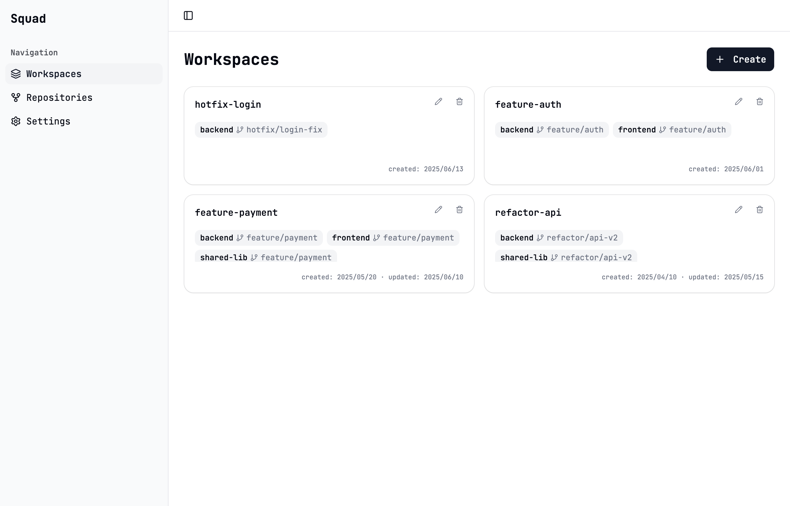
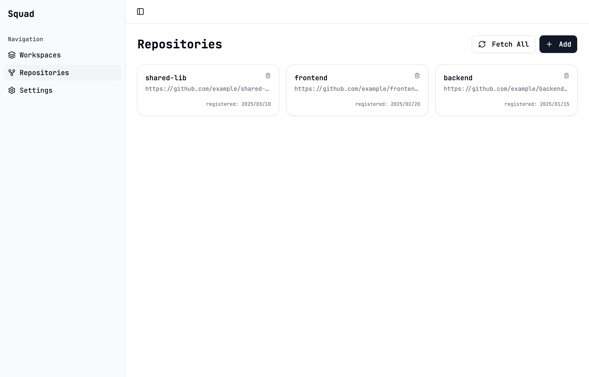

<p align="center">
  
</p>

<h1 align="center">Squad</h1>

<p align="center">
  A desktop app for managing development environments (Workspaces) across multiple Git repositories
</p>

<p align="center">
  
  
  
  
  
</p>

<p align="center">
  <a href="docs/README.ja.md">日本語</a>
</p>

---

## What is Squad?

When working on features that span multiple repositories, you typically have to create branches, set up worktrees, and write `.code-workspace` files for each repo manually. Squad automates all of that.

1. Register repositories (cloned as Bare Repositories under `~/.squad/repos/`)
2. Create a Workspace by selecting repositories × branches
3. Squad auto-generates git worktrees + `.code-workspace` and launches VS Code with one click





## Features

| Feature               | Description                                                        |
| --------------------- | ------------------------------------------------------------------ |
| Repository Management | Register and remove repositories via HTTPS / SSH URLs              |
| Branch Listing        | Fetch and browse remote branches                                   |
| New Branch Creation   | Create new branches from existing ones and add them to a Workspace |
| Workspace Creation    | Compose a dev environment from multiple repositories × branches    |
| VS Code Integration   | Auto-generate `.code-workspace` and open VS Code with one click    |
| Workspace Cleanup     | Remove worktrees, files, and store entries in one operation        |

## Tech Stack

| Layer           | Technology                                         |
| --------------- | -------------------------------------------------- |
| Frontend        | Angular 21 (standalone, zoneless, signals)         |
| UI Components   | spartan-ng/brain + spartan-ng/helm                 |
| Styling         | Tailwind CSS 4 + class-variance-authority          |
| Desktop         | Electron 40 (contextIsolation + contextBridge IPC) |
| Validation      | zod 4                                              |
| Testing         | Vitest 4 (happy-dom)                               |
| Linting         | ESLint 9 + Prettier 3                              |
| Package Manager | pnpm 9                                             |

## Installation

Download the latest `.dmg` from [GitHub Releases](https://github.com/mzkmnk/squad-app/releases).

> Releases are automatically published via GitHub Actions when `main` is updated.

## Development

### Prerequisites

- Node.js 22+
- pnpm 9+
- Git
- VS Code (required to open Workspaces)

### Installation

```bash
git clone https://github.com/mzkmnk/squad-app.git
cd squad-app
pnpm install
```

### Development

Use two terminals:

```bash
# Terminal 1: Angular dev server
pnpm ng serve

# Terminal 2: Launch Electron
pnpm electron:serve
```

### Build & Package

```bash
# Angular production build
pnpm build

# Electron TypeScript compile
pnpm electron:build

# Full package (dmg / zip)
pnpm package
```

## Testing

```bash
# Run all tests
pnpm test

# Angular tests only
pnpm test:ng

# Electron tests only
pnpm test:electron
```

## Linting & Formatting

```bash
pnpm lint          # ESLint
pnpm lint:fix      # ESLint auto-fix
pnpm format        # Prettier format
pnpm format:check  # Prettier check (for CI)
```

## Project Structure

```
src/                          # Angular application
  app/
    workspaces/               # Workspace list & creation
    repos/                    # Repository list & registration
    shared/                   # Shared components (branch selector, etc.)
    services/                 # Angular services (IPC wrappers)

electron/                     # Electron main process
  git/                        # Git operations (clone, worktree, fetch, branch)
  ipc/                        # IPC handlers & channel definitions
  store/                      # JSON file-based data persistence
  types/                      # Shared type definitions (IpcResult, models, error codes)
```

## Architecture

```
Angular (Renderer)
  ↓ window.electronAPI.*()
Preload (contextBridge)
  ↓ ipcRenderer.invoke()
IPC Handlers (Main Process)
  ↓
Git Service / Store
```

- All IPC responses are wrapped in `IpcResult<T>` (a discriminated union of success / error)
- Errors are classified by `IpcErrorCode` (`VALIDATION_ERROR`, `NOT_FOUND`, `GIT_OPERATION_FAILED`, etc.)
- Data models are defined with zod schemas, unifying types and validation

## Data Storage

| Type              | Path                              |
| ----------------- | --------------------------------- |
| Repository config | `~/.squad/config/repos.json`      |
| Workspace config  | `~/.squad/config/workspaces.json` |
| Bare Repositories | `~/.squad/repos/`                 |
| Worktrees         | `~/.squad/workspaces/`            |

## License

This project is licensed under the [MIT License](LICENSE).
