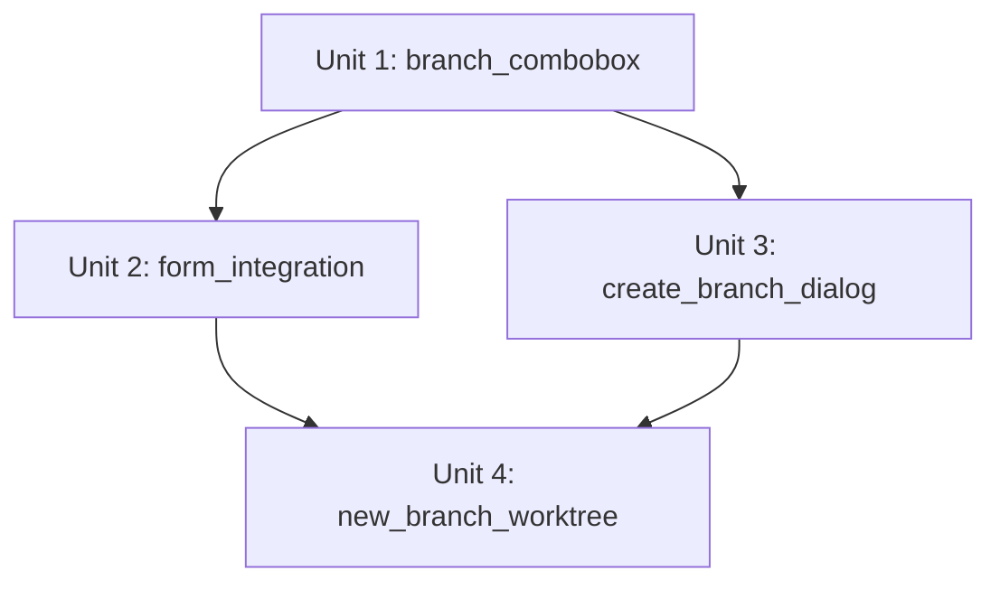

# Units: ブランチ選択オートコンプリート

## Unit一覧

### Unit 1: branch_combobox

**説明**: ブランチ選択用のオートコンプリート（コンボボックス）コンポーネントを新規作成する。

**スコープ:**

- テキスト入力による部分一致フィルタリング（大文字小文字を区別しない）
- 空入力時の全候補表示
- 候補クリックによる選択・入力欄への反映・候補リスト閉じ
- キーボード操作（上下矢印キーで候補移動、Enter で選択、Escape で閉じ）
- WAI-ARIA combobox パターンに準拠したアクセシビリティ対応

**対応するストーリー:** US1, US2, AC1〜AC6

**依存関係:**

- なし

---

### Unit 2: form_integration

**説明**: Workspace 作成フォームの既存ブランチ選択ドロップダウンを Unit 1 のコンボボックスに置き換え、「新規作成」ボタンを追加する。

**スコープ:**

- ブランチ選択 UI をドロップダウンからコンボボックスに差し替え
- 各リポジトリのブランチ入力欄の横に「新規作成」ボタンを配置
- 新規ブランチ情報（起点ブランチ・新規ブランチ名）をフォーム状態として保持
- 送信時に新規ブランチ情報を含めて Workspace 作成を実行

**対応するストーリー:** US1, US2, AC7, AC15

**依存関係:**

- Unit 1: branch_combobox

---

### Unit 3: create_branch_dialog

**説明**: 新規ブランチ作成ダイアログを作成する。起点ブランチの選択、新規ブランチ名の入力・バリデーション・重複チェックを含む。

**スコープ:**

- 起点ブランチ入力欄（Unit 1 のコンボボックスを再利用）
- 起点ブランチのデフォルト値としてデフォルトブランチを初期設定
- 新規ブランチ名の入力欄
- Git 命名規則に基づくバリデーション
- 既存ブランチとの重複チェック
- 作成ボタン（バリデーション通過時のみ有効）・キャンセルボタン
- ダイアログ内のフォーカストラップ

**対応するストーリー:** US3, US4, US5, AC8〜AC14

**依存関係:**

- Unit 1: branch_combobox

---

### Unit 4: new_branch_worktree

**説明**: Workspace 作成時に、新規ブランチを起点ブランチから作成して worktree を追加する機能をバックエンドに実装する。

**スコープ:**

- Workspace 作成リクエストで新規ブランチ情報（起点ブランチ・新規ブランチ名）を受け取れるようにする
- 起点ブランチから新規ブランチを作成し worktree を追加する処理
- エラー時のロールバック対応

**対応するストーリー:** AC15

**依存関係:**

- Unit 2: form_integration
- Unit 3: create_branch_dialog

---

## 実装順序

1. **Unit 1** — コンボボックスコンポーネント（他の全 Unit の基盤）
2. **Unit 2 & Unit 3** — フォーム統合とダイアログ（並行実装可能）
3. **Unit 4** — バックエンドの新規ブランチ worktree 対応

## 更新履歴

| 日付       | 内容     |
| ---------- | -------- |
| 2026-02-10 | 初版作成 |
