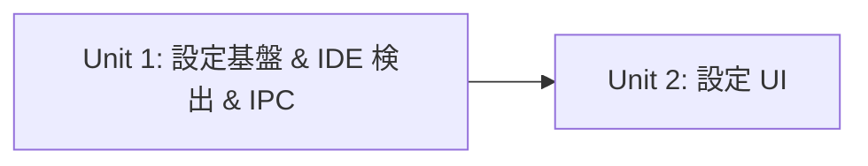
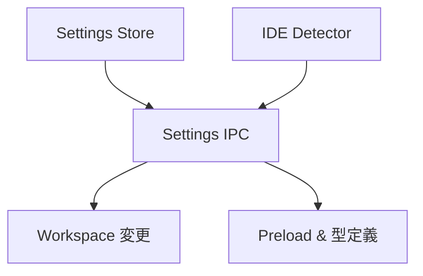
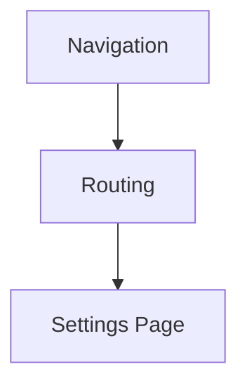

# 依存関係マトリクス — IDE Selector & Settings

## Unit 間依存関係

| 依存元 | 依存先 | 依存内容                                                                                   |
| ------ | ------ | ------------------------------------------------------------------------------------------ |
| Unit 2 | Unit 1 | IPC API（`settings:get`, `settings:update`, `settings:detect-ides`）、`ElectronAPI` 型定義 |

## Unit 内 Module 依存関係

### Unit 1

| Module           | 依存先                       | 依存内容                                    |
| ---------------- | ---------------------------- | ------------------------------------------- |
| Settings Store   | なし                         | —                                           |
| IDE Detector     | なし                         | —                                           |
| Settings IPC     | Settings Store, IDE Detector | ストア CRUD、検出結果取得                   |
| Workspace 変更   | Settings IPC                 | 設定値の読み取り（選択された IDE コマンド） |
| Preload & 型定義 | Settings IPC                 | チャネル名、リクエスト/レスポンス型         |

### Unit 2

| Module        | 依存先        | 依存内容                        |
| ------------- | ------------- | ------------------------------- |
| Settings Page | Unit 1（IPC） | `window.electronAPI` 経由の API |
| Navigation    | Routing       | `/settings` ルートへのリンク    |
| Routing       | Settings Page | コンポーネント参照              |

## 実装順序

1. Unit 1: Settings Store → IDE Detector → Settings IPC → Workspace 変更 → Preload & 型定義
2. Unit 2: Settings Page → Routing → Navigation
