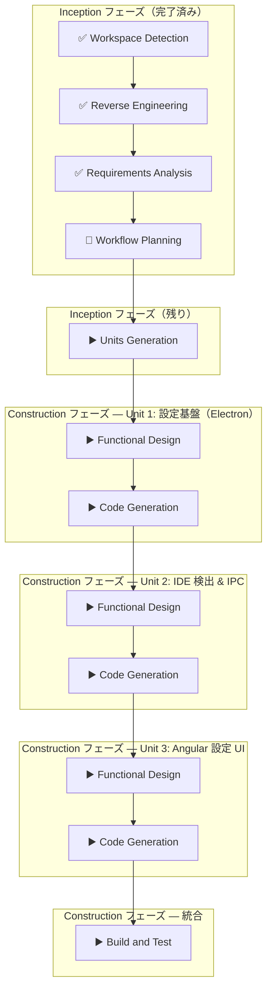

# Workflow Plan — IDE Selector & Settings

## 先行成果物サマリー

| 成果物                                  | 状態    | 内容                                                             |
| --------------------------------------- | ------- | ---------------------------------------------------------------- |
| `audit.md`                              | ✅ 完了 | brownfield 判定、既存コード分析、影響範囲の特定                  |
| `requirement-verification-questions.md` | ✅ 完了 | 全 9 問に回答済み、曖昧さなし                                    |
| `requirements.md`                       | ✅ 完了 | FR-1〜FR-8、NFR-1〜NFR-3、EC-1〜EC-2、影響範囲、スコープ外を定義 |

## 複雑さ評価

| 要因               | 評価                                                                                   |
| ------------------ | -------------------------------------------------------------------------------------- |
| リクエストの明確さ | 高 — 要件定義書が詳細に完成済み                                                        |
| 問題の複雑さ       | 中 — Electron IPC + Angular UI + 設定永続化の3層にまたがるが、既存パターンの踏襲が多い |
| スコープ           | 中 — 既存ファイル 10+ 変更、新規ファイル 3 作成                                        |
| リスクレベル       | 低 — 既存の IPC/Store パターンに沿った拡張                                             |
| 既存コンテキスト   | brownfield — 既存パターンが明確で参照可能                                              |

→ 適応的深度: **Standard**

## ステージ判定

### Inception フェーズ

| ステージ              | 判定        | 深度     | 理由                                                                                          |
| --------------------- | ----------- | -------- | --------------------------------------------------------------------------------------------- |
| Workspace Detection   | ✅ 完了     | —        | `audit.md` で brownfield 判定済み                                                             |
| Reverse Engineering   | ✅ 完了     | —        | `audit.md` に既存コード分析・影響範囲を記録済み                                               |
| Requirements Analysis | ✅ 完了     | —        | `requirements.md` + 検証質問が完了済み                                                        |
| User Stories          | ⏭️ スキップ | —        | 要件が十分に明確。単一ペルソナ（開発者）で自明なフロー                                        |
| Workflow Planning     | 🔄 実行中   | Standard | 本ステージ                                                                                    |
| Application Design    | ⏭️ スキップ | —        | 既存アーキテクチャ（IPC + Store + Angular）の拡張であり、新規設計判断が少ない                 |
| Units Generation      | ▶️ 実行     | Standard | 3 層（Electron 設定基盤 / IPC + IDE 検出 / Angular UI）に分解し、依存順序を定義する必要がある |

### Construction フェーズ（Unit 単位）

| ステージ              | 判定        | 深度     | 理由                                                          |
| --------------------- | ----------- | -------- | ------------------------------------------------------------- |
| Functional Design     | ▶️ 実行     | Standard | zod スキーマ、IPC 仕様、IDE 検出ロジックの詳細設計が必要      |
| NFR Requirements      | ⏭️ スキップ | —        | NFR は要件定義書で十分にカバー済み（並列検出、execFile 使用） |
| NFR Design            | ⏭️ スキップ | —        | 特別な NFR パターン設計は不要（既存パターン踏襲）             |
| Infrastructure Design | ⏭️ スキップ | —        | デスクトップアプリのため不要                                  |
| Code Generation       | ▶️ 実行     | Standard | Planning → Generation の 2 パートで実装                       |
| Build and Test        | ▶️ 実行     | Standard | 全 Unit 完了後にビルド・テスト確認                            |

## 実行計画

## 実行順序まとめ

| #   | ステージ                                    | 状態      |
| --- | ------------------------------------------- | --------- |
| 1   | Workspace Detection                         | ✅ 完了   |
| 2   | Reverse Engineering                         | ✅ 完了   |
| 3   | Requirements Analysis                       | ✅ 完了   |
| 4   | Workflow Planning                           | 🔄 実行中 |
| 5   | Units Generation                            | ▶️ 次     |
| 6   | Unit 1: 設定基盤 — Functional Design        | ▶️ 予定   |
| 7   | Unit 1: 設定基盤 — Code Generation          | ▶️ 予定   |
| 8   | Unit 2: IDE 検出 & IPC — Functional Design  | ▶️ 予定   |
| 9   | Unit 2: IDE 検出 & IPC — Code Generation    | ▶️ 予定   |
| 10  | Unit 3: Angular 設定 UI — Functional Design | ▶️ 予定   |
| 11  | Unit 3: Angular 設定 UI — Code Generation   | ▶️ 予定   |
| 12  | Build and Test                              | ▶️ 予定   |
