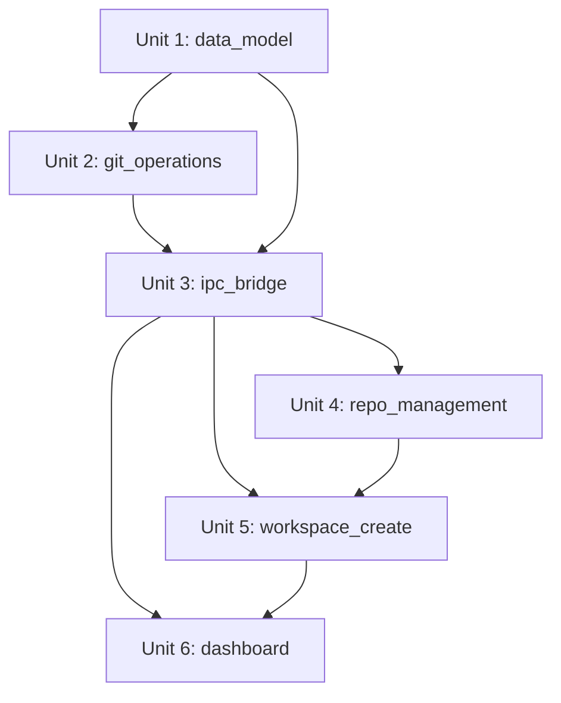

# Units: Workspace Core

## Unit一覧

### Unit 1: data_model

**説明**: リポジトリ・Workspaceのデータモデル定義と、`~/.squad` 配下の永続化ストアを実装する。アプリ全体の基盤となるレイヤー。

**スコープ:**

- リポジトリ型定義（名前、リモートURL、ローカルパス）
- Workspace型定義（名前、リポジトリ×ブランチ構成、作成日時）
- `~/.squad` ディレクトリ構造の初期化（`repos/`, `workspaces/`, `config/`）
- JSON ベースの設定ファイル読み書き（リポジトリ一覧、Workspace一覧）
- アプリ再起動後のデータ復元（AC10）
- 全データが `~/.squad` 配下に隔離されることの保証（AC11）

**対応する受入条件:**

- AC10: アプリ再起動後もWorkspace設定が保持される
- AC11: 全データが `~/.squad` 配下に隔離される

**依存関係:**

- なし

---

### Unit 2: git_operations

**説明**: Git CLI をラップしたサービスレイヤーを実装する。Bare Repository のクローン、Worktree の作成・削除、fetch 等の操作を提供する。

**スコープ:**

- `git clone --bare` によるリポジトリ登録（`~/.squad/repos/<name>.git`）
- `git worktree add` による指定ブランチの Worktree 作成
- `git worktree remove` による Worktree 削除
- `git fetch` によるリモートブランチ一覧の更新
- リモートブランチ一覧の取得（`git branch -r`）
- `.code-workspace` ファイルの生成・削除
- 入力値（URL、ブランチ名）のバリデーション（コマンドインジェクション防止）

**対応する受入条件:**

- AC1: リポジトリをBare Repositoryとして登録できる
- AC3: Worktree作成 + `.code-workspace` 生成
- AC4: リポジトリごとに異なるブランチのWorktree作成
- AC5: auto-fetch によるブランチ一覧更新
- AC8: Worktree・`.code-workspace` の削除
- AC9: Worktreeの独立性（git worktreeの仕組みにより保証）

**依存関係:**

- Unit 1: data_model（パス解決、データモデル参照）

---

### Unit 3: ipc_bridge

**説明**: Electron の IPC チャネル定義・メインプロセスハンドラー・preload API を実装する。レンダラーとメインプロセス間の型安全な通信基盤。

**スコープ:**

- IPC チャネル名の型定義（shared types）
- メインプロセス側の `ipcMain.handle` ハンドラー登録
  - リポジトリ CRUD 操作
  - Workspace CRUD 操作
  - Git 操作（fetch, ブランチ一覧取得）
  - VS Code 起動（`code` コマンドで `.code-workspace` を開く）
- preload スクリプトの `contextBridge.exposeInMainWorld` 拡張
- `window.electronAPI` の型定義更新
- セキュリティ要件の維持（`contextIsolation: true`, `nodeIntegration: false`）

**対応する受入条件:**

- セキュリティ非機能要件全般

**依存関係:**

- Unit 1: data_model（型定義の共有）
- Unit 2: git_operations（メインプロセスからの呼び出し）

---

### Unit 4: repo_management

**説明**: リポジトリ管理画面の Angular コンポーネントとサービスを実装する。リポジトリの追加・一覧表示機能を提供する。

**スコープ:**

- リポジトリ管理画面コンポーネント（スタンドアロンコンポーネント）
- リポジトリ追加フォーム（URL入力、バリデーション）
- 登録済みリポジトリ一覧表示（名前・URL）
- IPC 経由でのリポジトリ登録・取得 Angular サービス
- クローン進捗のフィードバック表示

**対応する受入条件:**

- AC1: リポジトリをBare Repositoryとして登録できる
- AC2: 登録済みリポジトリの一覧を表示できる

**依存関係:**

- Unit 3: ipc_bridge（レンダラーからメインプロセスへの通信）

---

### Unit 5: workspace_create

**説明**: Workspace 作成フローの Angular コンポーネントとサービスを実装する。名前入力・リポジトリ選択・ブランチ指定・Workspace生成までの一連の操作を提供する。

**スコープ:**

- Workspace 作成画面コンポーネント（スタンドアロンコンポーネント）
- Workspace 名入力フォーム
- 登録済みリポジトリの選択UI（複数選択可）
- リポジトリごとのブランチ指定UI（非対称ブランチ対応）
- 画面表示時の auto-fetch 実行（バックグラウンド非同期、UIノンブロッキング）
- 作成実行時の Worktree 生成 + `.code-workspace` 作成 + VS Code 起動
- 作成処理の進捗フィードバック

**対応する受入条件:**

- AC3: Workspaceを作成しVS Codeで開ける
- AC4: リポジトリごとに異なるブランチを指定できる
- AC5: Workspace作成時にauto-fetchが実行される
- AC9: 複数Workspaceが互いに干渉しない
- パフォーマンス要件: Workspace作成5秒以内、fetch非同期実行

**依存関係:**

- Unit 3: ipc_bridge（レンダラーからメインプロセスへの通信）
- Unit 4: repo_management（登録済みリポジトリの参照）

---

### Unit 6: dashboard

**説明**: Dashboard 画面の Angular コンポーネントを実装する。Workspace 一覧表示・Open・Delete 操作を提供するアプリのメイン画面。

**スコープ:**

- Dashboard 画面コンポーネント（スタンドアロンコンポーネント）
- Workspace 一覧表示（名前・リポジトリ・ブランチ構成）
- Workspace Open 操作（`.code-workspace` で VS Code 起動）
- Workspace Delete 操作（確認ダイアログ + 完全消去）
- 初期表示1秒以内のパフォーマンス最適化
- ルーティング設定（Dashboard をデフォルト画面として設定）

**対応する受入条件:**

- AC6: Dashboard でWorkspace一覧を確認できる
- AC7: 既存Workspaceを再度開ける
- AC8: Workspaceを削除しディスクからも消去できる
- AC10: アプリ再起動後もWorkspace設定が保持される
- パフォーマンス要件: Dashboard初期表示1秒以内

**依存関係:**

- Unit 3: ipc_bridge（レンダラーからメインプロセスへの通信）
- Unit 5: workspace_create（Workspace作成画面への遷移）

---

## 実装順序

**推奨実装フロー:**

1. **Unit 1: data_model** — 全Unitの基盤。最初に実装。
2. **Unit 2: git_operations** — data_model の型を使い、Git操作を実装。
3. **Unit 3: ipc_bridge** — data_model + git_operations を繋ぐIPC層。
4. **Unit 4: repo_management** — 最初のUI。リポジトリ登録ができないと後続が動かない。
5. **Unit 5: workspace_create** — リポジトリが登録済みの状態でWorkspace作成。
6. **Unit 6: dashboard** — 最後にメイン画面。全機能を統合。

**備考:**

- Unit 4 と Unit 6 はIPC層への依存のみで、互いに直接依存しない部分もあるが、ユーザーフロー上「リポジトリ登録 → Workspace作成 → Dashboard」の順が自然。
- Unit 5 と Unit 6 は一部並行開発可能だが、Dashboard から Workspace 作成画面への遷移があるため、Unit 5 を先に完了させるのが望ましい。
