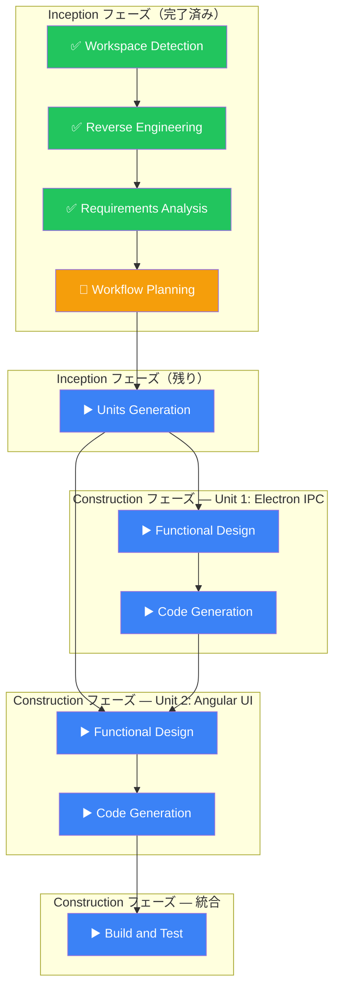

# Workflow Plan — workspace-edit

## 1. 先行成果物サマリ

| 成果物                         | 状態    | 主な結論                                                                                         |
| ------------------------------ | ------- | ------------------------------------------------------------------------------------------------ |
| Workspace Detection (audit.md) | ✅ 完了 | brownfield 判定。Workspace CRUD は実装済み、編集機能のみ未実装                                   |
| Reverse Engineering            | ✅ 完了 | 通信フロー・既存型・再利用可能資産・技術的制約を文書化済み                                       |
| Requirements Analysis          | ✅ 完了 | FR-1〜FR-5、UI-1〜UI-3、NFR-1〜NFR-2 を定義。スコープ外も明確化済み                              |
| Verification Questions         | ✅ 完了 | 全質問に回答済み。スコープ = エントリ追加 + 削除のみ。専用編集ページ方式。同一リポジトリ重複不可 |

## 2. ステージ判定

### Inception フェーズ

| ステージ              | 判定        | 深度   | 理由                                                                                                |
| --------------------- | ----------- | ------ | --------------------------------------------------------------------------------------------------- |
| Workspace Detection   | ✅ 完了     | —      | brownfield 判定済み                                                                                 |
| Reverse Engineering   | ✅ 完了     | Deep   | 既存アーキテクチャ・型定義・再利用資産を詳細分析済み                                                |
| Requirements Analysis | ✅ 完了     | Deep   | 機能要件・UI 要件・非機能要件・IPC 設計・スコープ外を定義済み                                       |
| User Stories          | ⏭️ スキップ | —      | 要件が十分に具体的で、ペルソナ・ストーリー形式の追加価値が低い。受入条件は要件から直接導出可能      |
| Workflow Planning     | 🔄 実行中   | —      | 本ステージ                                                                                          |
| Application Design    | ⏭️ スキップ | —      | 既存アーキテクチャに沿った拡張であり、新規コンポーネント設計は Functional Design で十分カバーできる |
| Units Generation      | ▶️ 実行     | Medium | Electron 側と Angular 側で明確に分離可能。依存関係と実装順序の定義が必要                            |

### Construction フェーズ（Unit 単位）

| ステージ              | 判定        | 深度 | 理由                                                                                  |
| --------------------- | ----------- | ---- | ------------------------------------------------------------------------------------- |
| Functional Design     | ▶️ 実行     | Deep | IPC リクエスト/レスポンス型、zod スキーマ、ビジネスルール、テスト計画の詳細設計が必要 |
| NFR Requirements      | ⏭️ スキップ | —    | NFR は要件分析で十分定義済み（整合性・ロールバック・IDE 連携）。追加の NFR 分析は不要 |
| NFR Design            | ⏭️ スキップ | —    | ロールバックパターンは既存実装（workspace:create）を踏襲。新規 NFR パターン設計は不要 |
| Infrastructure Design | ⏭️ スキップ | —    | インフラ変更なし（デスクトップアプリ、既存ディレクトリ構造を使用）                    |
| Code Generation       | ▶️ 実行     | —    | 常に実行。TDD で Planning → Generation の2パート                                      |
| Build and Test        | ▶️ 実行     | —    | 常に実行。全 Unit 完了後にビルド・テスト確認                                          |

## 3. 実行計画

## 4. Unit 構成（暫定）

Units Generation で正式に定義するが、現時点の想定:

| Unit                 | スコープ                                                                                    | 依存関係 |
| -------------------- | ------------------------------------------------------------------------------------------- | -------- |
| Unit 1: Electron IPC | IPC チャネル定義、リクエスト型、ハンドラー実装（add-entry / remove-entry）、preload・型更新 | なし     |
| Unit 2: Angular UI   | WorkspaceService 拡張、編集ページコンポーネント、ルーティング、一覧画面への編集ボタン追加   | Unit 1   |

## 5. スキップしたステージの根拠

- User Stories: 要件が FR/UI/NFR で十分具体的。Given-When-Then 形式への変換は形式的作業になるため省略
- Application Design: 既存アーキテクチャ（IPC → Service → Store パターン）をそのまま踏襲。新規アーキテクチャ判断が不要
- NFR Requirements / Design: ロールバック・整合性パターンは既存実装を踏襲。新規 NFR パターンの設計判断が不要
- Infrastructure Design: デスクトップアプリのため、インフラ変更なし
